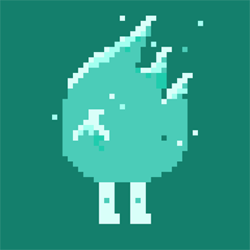

# Hi there.  :ocean: I'm Mara Mulato.
*I studied web development at* [Laboratoria](https://www.laboratoria.la/)

*Self-taught illustrator*

*Nature lover*

[ LinkedIn](https://www.linkedin.com/in/mm-mulato/)
&nbsp;

### About me

I am a Front-End developer with interest and background in education, arts and humanities. My natural curiosity and creativity encouraged me to get involved with technology, as it is the meeting point of optimum use between logic and the beauty of design.

### About my work

* :floppy_disk: Currently working with `JavaScript, NodeJs, React, SocketIO, HTML, CSS, SASS`
* :art: Some other tools `Adobe Photoshop, FIGMA, MapBox`,
* :seedling: Currently learning `Python, D3.js`
* :zap: I want to work on technologies and projects that focus on the arts, education and nature.
* :envelope: **Say hello** marecito@tuta.io
